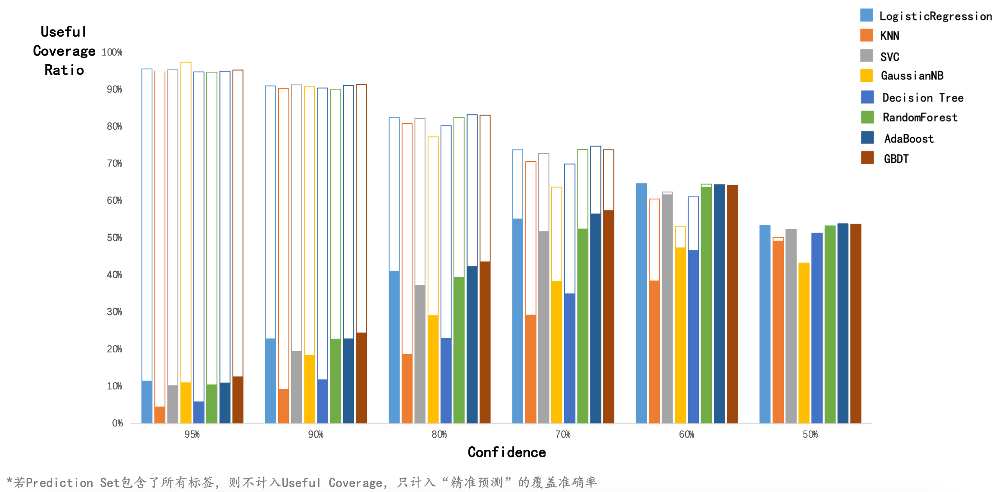
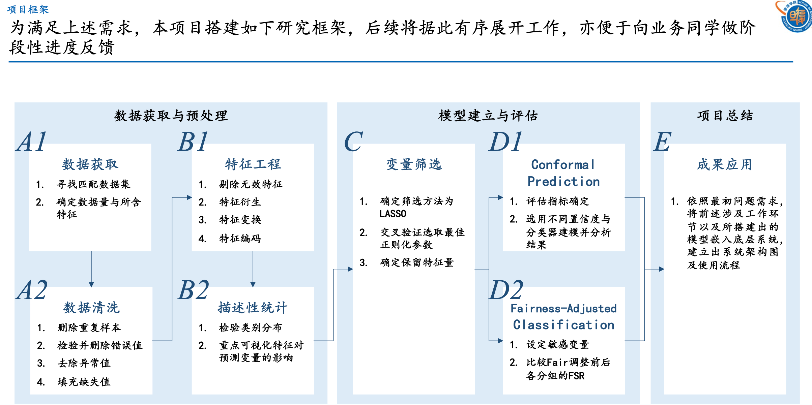
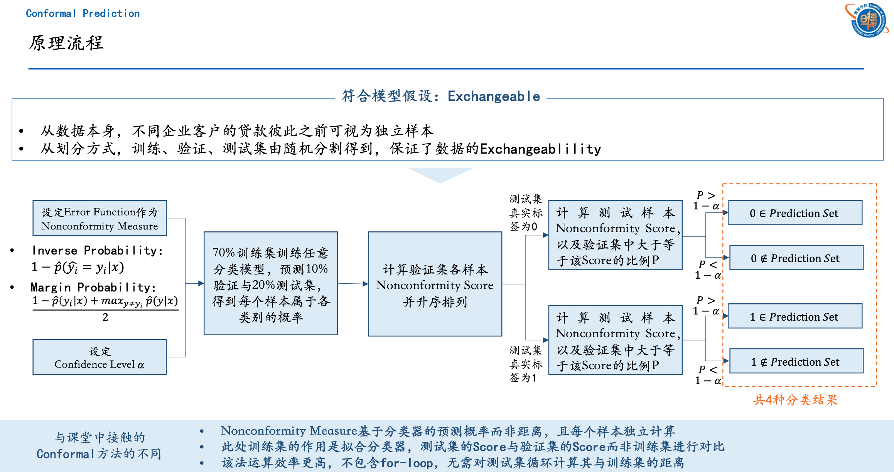
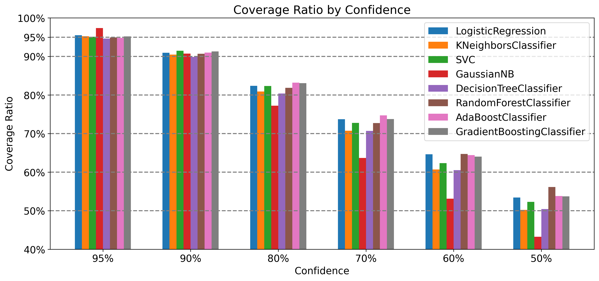

# 使用 Conformal Learning 预测企业信贷违约情况

本文使用 8 种经典的分类器，基于逆概率错误进行 Conformal Learning。

本文使用了 [`nonconformist`](https://github.com/donlnz/nonconformist) 包，它在使用 Conformal Learning 进行分类预测时的核心步骤是：

1. 在训练集上训练，这一步和常规的机器学习训练相同。
2. 在校准集上校准，得到每个校准集样本属于每个标签的预测概率。
3. 用一个 ErrFunc 衡量每个校准集样本的预测效果，作为 nonconformity score。最简单的是 `InverseProbabilityErrFunc`，它等于 `1-predict_probability[true_y]`。例如，某个样本的真实标签是 1，而模型预测出该样本属于标签 1 的概率是 0.9，则 ErrFunc 的值是 1-0.9=0.1。
4. 在测试集上测试，得到每个测试集样本属于每个标签的预测概率。
5. 用 ErrFunc 衡量每个测试集样本的预测效果。
6. 对每一个测试集样本，计算：有多少比例的校准集样本的 nonconformity score 大于或等于当前测试样本的 nonconformity score，记为 p。p 越大，说明校准集中有非常多的样本比当前测试集样本的预测效果更差，说明第 j 个测试样本属于第 i 个类的可能性越大。
7. 返回 p > significance。得到一个 N*2 的 True 和 False 组成的二维矩阵，每一行代表一个测试集样本，每一列代表是否将该标签纳入该样本的 prediction set 中。



本项目的完整展示文件在[这里](./nonconformist-for-firm-loan-slides.pdf)。

<!-- more -->

## 项目框架



## Conformal Prediction 原理流程



## Conformal Prediction 预测结果

!!! tip "由有效覆盖率得到的结论"

	当置信度为 $60\%$ 时，有效覆盖率较高，说明此时模型给出的预测集基本都是精准的预测，而不是包含两种标签的模糊预测。


## Conformal Prediction 代码

完整代码见 [GitHub](https://github.com/jeremy-feng/statistical-data-analysis-method-coursework/tree/main/Group-Project-Conformal-Learning)。

```python
def get_prediction_set(model, confidence=0.9, err_func=InverseProbabilityErrFunc()):
    # 创建一个 Nonconformity function
    nc = NcFactory.create_nc(model=model, err_func=err_func)
    # 创建一个 inductive conformal classifier
    icp = IcpClassifier(nc)
    # 训练模型
    icp.fit(X_train, y_train)
    # 校准模型
    icp.calibrate(X_val, y_val)
    # 在测试集上进行预测，给出预测标签的集合
    prediction_set = icp.predict(X_test, significance=1 - confidence)
    # 计算 prediction set
    prediction_set = list(
        map(lambda row: tuple(i for i, x in enumerate(row) if x), prediction_set)
    )
    return prediction_set
```

## 绘制柱状图的代码

```python
import matplotlib.pyplot as plt
from matplotlib.ticker import FuncFormatter
from matplotlib_inline.backend_inline import set_matplotlib_formats

set_matplotlib_formats("svg")
plt.rcParams["axes.unicode_minus"] = False

# 设置百分数的格式
def to_percent(temp, position):
    return "%1.0f" % (100 * temp) + "%"
```

```python
# 设置字体为 14，用于图例中显示分类器名称
plt.rcParams["font.size"] = 14
# 设置画布大小
fig = plt.figure(figsize=(10, 6), dpi=300)
# 绘制柱状图
for i, model in enumerate(coverage_ratios.index):
    plt.bar(
        [x + i * 0.08 for x in range(coverage_ratios.shape[1])],
        coverage_ratios.loc[model],
        width=0.08,
        label=model,
    )
# 设置横坐标刻度
plt.xticks(
    [x + 0.28 for x in range(coverage_ratios.shape[1])],
    [f"{confidences[x]*100:.0f}%" for x in range(coverage_ratios.shape[1])],
)
# 设置纵坐标刻度
plt.yticks([x / 10 for x in range(4, 11)] + [0.95])
# 设置纵轴百分比显示格式
plt.gca().yaxis.set_major_formatter(FuncFormatter(to_percent))
# 添加置信度的水平线
for confidence in confidences:
    plt.axhline(y=confidence, color="gray", linestyle="--")
# y 轴范围
plt.ylim(0.4, 1)
# 添加 xy 轴标签和标题
plt.xlabel("Confidence")
plt.ylabel("Coverage Ratio")
plt.title("Coverage Ratio by Confidence")
# 添加分类器名称的图例
plt.legend(loc="upper right")
# 显示图形
plt.show()
# 保存图形
fig.savefig(
    "./results/Coverage Ratio by Confidence.png",
    format="png",
    facecolor="white",
    bbox_inches="tight",
)
```


