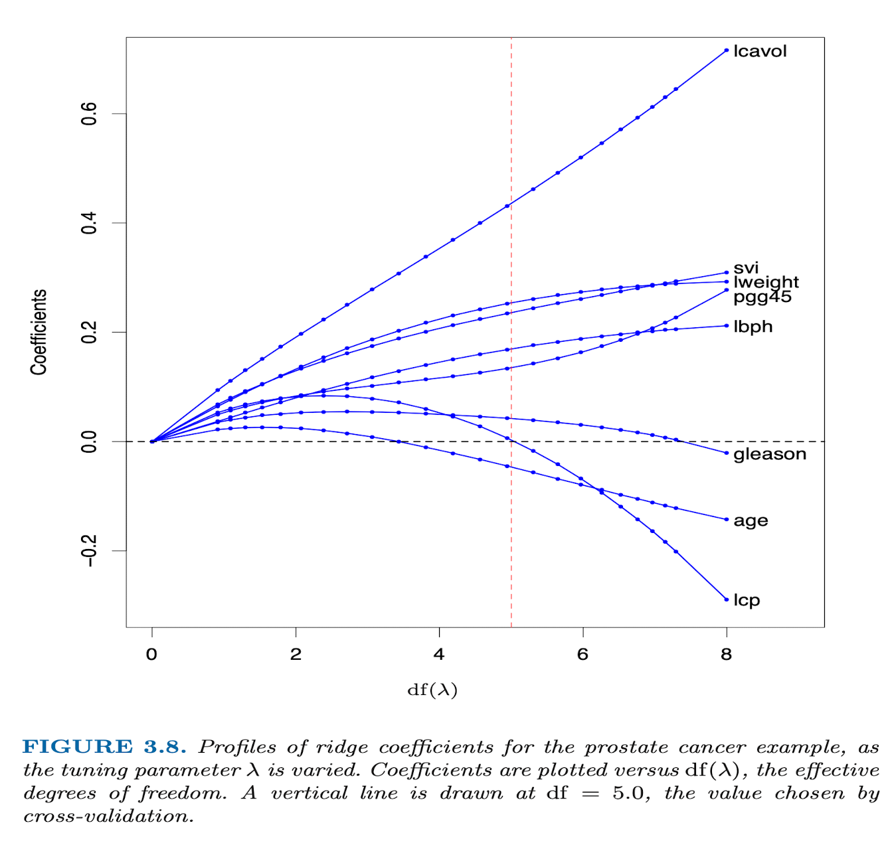
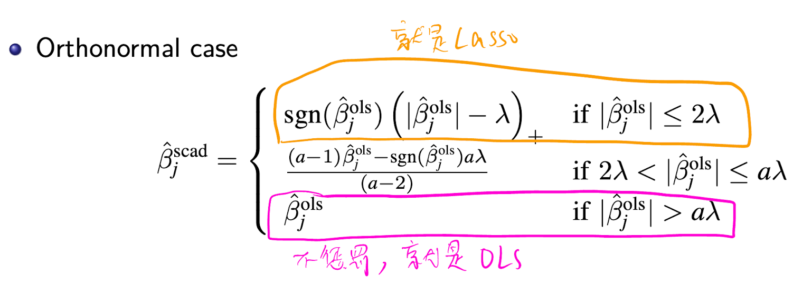

# 使用不同惩罚项的线性回归进行变量选择

本文使用 SCAD、LASSO、Ridge 和 Garrote 惩罚项对线性回归进行了建模，在模拟数据下验证了不同惩罚项设计的对稀疏系数的选择能力。

原始论文的标题叫做 Variable Selection via Nonconcave Penalized Likelihood and Its Oracle Properties。对于 Oracle Properties，在 [统计之都上有一个非常精彩的解释](https://d.cosx.org/d/104104-104104/18)：

> Oracle 这个词对应的中文翻译叫做“神谕”，就是神的启示，它是指通过媒介（男女祭司或器物）传达神的难以捉摸或谜一般的启示或言语。在罚函数（比如 LASSO) 的研究领域，Oracle 指的是以下的渐进性质：
>
> 1. 真值为 0 的参数的估计也为 0。
> 2. 真值不为 0 的参数的估计值一致收敛到真值，并且协方差矩阵不受那些真值为 0 的参数估计的影响。
>
> 简而言之：罚函数的估计结果就好像事先已经得到了神的启示，知道哪些是真值为 0 的参数一样。

## 理论性质

### Ridge 惩罚项

Ridge 对系数的估计为：

$$
\hat{\beta} = \arg \min_{\beta} \left\{ \sum_{i=1}^n (y_i - \sum_{j=1}^p x_{ij} \beta_j)^2 + \lambda \sum_{j=1}^p \beta_j^2 \right\}
$$

其中 $\lambda$ 是惩罚项的系数，$p$ 是变量的个数，$\beta_j$ 是第 $j$ 个变量的系数。

Ridge 惩罚项相当于将所有变量的系数都向 0 靠拢，但很难产生稀疏系数。



### LASSO 惩罚项

LASSO 对系数的估计为：

$$
\hat{\beta} = \arg \min_{\beta} \left\{ \sum_{i=1}^n (y_i - \sum_{j=1}^p x_{ij} \beta_j)^2 + \lambda \sum_{j=1}^p |\beta_j| \right\}
$$

其中 $\lambda$ 是惩罚项的系数，$p$ 是变量的个数，$\beta_j$ 是第 $j$ 个变量的系数。

LASSO 惩罚项可以产生稀疏系数。从下图可以看出，等高线往外扩张时，很容易先与尖点接触，而尖点对应的某一个变量的系数为 0，这意味着产生了稀疏系数。


从系数的估计结果与真实值的关系上看，Ridge 惩罚项的系数是绕着原点向右下方旋转，即不论真实值的大小，系数的估计值都会向 0 靠拢。而 LASSO 惩罚项的系数是向下方平移，并将那些估计值太小的系数直接置为 0。


### Non-negative Garrote 惩罚项

Non-negative Garrote 惩罚项对系数的估计为：

$$
\hat{\beta} = \arg \min_{\beta} \left\{ \sum_{i=1}^n (y_i - \sum_{j=1}^p d_j \hat{\beta}_j^{ols} x_{ij})^2 + \lambda \sum_{j=1}^p d_j \right\}
$$

其中 $d_j \le 0$。

这个式子看起来很复杂，它的思想就是：若 $\beta_j$ 本身就很大，那么就不需要对 $\beta_j$ 进行太多的惩罚，否则容易得到有偏的估计。


### SCAD 惩罚项

SCAD 惩罚项对系数的估计为：

$$
\min _{\beta_j} \frac{1}{2} \sum_{i=1}^n\left(y_i-\sum_{j=1}^p \beta_j x_{i j}\right)^2+\lambda \cdot \sum_{j=1}^p p\left(\beta_j\right)
$$

其中 $p(\beta_j)$ 是 SCAD 惩罚项的函数，它的定义为：

$$
p(\beta)= \begin{cases}|\beta| & \text { if }|\beta| \leq \lambda \\ \frac{(a+1) \lambda}{2}-\frac{(a \lambda-|\beta|)^2}{2(a-1) \lambda} & \text { if } \lambda<|\beta| \leq a \lambda \\ \frac{(a+1) \lambda}{2} & \text { if }|\beta|>a \lambda\end{cases}
$$

其中 $a > 2$ 是一个常数，经验上通常取 $a=3.7$。

为什么要这样设定 SCAD 惩罚项的函数？因为在这样的惩罚项下，估计系数和 $\hat\beta^{ols}$ 的关系为：

$$
\hat{\beta}_j^{\text {scad }}= \begin{cases}\operatorname{sgn}\left(\hat{\beta}_j^{\text {ols }}\right)\left(\left|\hat{\beta}_j^{\text {ols }}\right|-\lambda\right)_{+} & \text {if }\left|\hat{\beta}_j^{\mathrm{ols}}\right| \leq 2 \lambda \\ \frac{(a-1) \hat{\beta}_j^{\text {ols }}-\operatorname{sgn}\left(\hat{\beta}_j^{\text {ols }}\right) a \lambda}{(a-2)} & \text { if } 2 \lambda<\left|\hat{\beta}_j^{\text {ols }}\right| \leq a \lambda \\ \hat{\beta}_j^{\text {ols }} &\text { if }\left|\hat{\beta}_j^{\mathrm{ols}}\right|>a \lambda\end{cases}
$$




## R 语言代码实现

统计分析领域确实最适合用 R 语言来实现，因为 R 语言有很多现成的包可以用来实现。但我对 R 语言中基础的数据结构和函数远远没有 Python 熟悉，所以这次作业还是花了不少时间的。

### 导入包

```R
library(ggplot2)
library(lattice)
library(data.table)
library(progress)
library(MASS) # 多元正态分布
library(caret) # 交叉验证
library(ncvreg) # SCAD, LASSO
library(Matrix)
library(glmnet) # Ridge
library(nnGarrote)
```

### 生成模拟数据的真实参数


```R
# 生成真实的自变量相关系数矩阵
rho <- matrix(0, 8, 8)
for (i in 1:8) {
    for (j in 1:8) {
        rho[i, j] <- 0.5^abs(i - j)
    }
}
# 生成真实的 beta
beta <- c(3, 1.5, 0, 0, 2, 0, 0, 0)
```

### 定义函数

自定义的函数包括：产生模拟数据、交叉验证寻找最优超参数、整理结果等。

```R
# 生成自变量和因变量的数据框
generate_data <- function(n, rho, beta, sigma) {
    # 生成多元正态分布的数据
    x <- mvrnorm(n, rep(0, 8), rho)
    # 生成因变量
    y <- x %*% beta + rnorm(n, 0, sigma)
    return(list(x = x, y = y))
}

# 计算 model error
cal_model_error <- function(beta, beta_hat, x) {
    expected_y <- x %*% beta
    expected_y_hat <- x %*% beta_hat
    return(mean((expected_y - expected_y_hat)^2))
}

# SCAD 交叉验证，寻找最优的 gamma 和 lambda
get_best_param_for_scad <- function(
    x, y, gamma_seq, lambda_seq, k = 5) {
    # 生成 k 折交叉验证的验证集索引列表
    validation_index_list <- createFolds(y, k = k, list = TRUE)
    # 对每个 gamma 和 lambda 的网格组合，计算 k 个验证集的 model error 的均值
    mean_me_list <- list()
    for (gamma in gamma_seq) {
        for (lambda in lambda_seq) {
            me_list <- c()
            for (i in 1:k) {
                # 生成训练集和验证集
                train_index <- validation_index_list[-i]
                validation_index <- validation_index_list[[i]]
                x_train <- x[unlist(train_index), ]
                y_train <- y[unlist(train_index)]
                x_validation <- x[unlist(validation_index), ]
                # 用训练集拟合模型
                fit <- ncvfit(x_train, y_train,
                    penalty = "SCAD", gamma = gamma,
                    lambda = lambda
                )
                # 计算验证集上的 model error
                beta_hat <- fit$beta
                me <- cal_model_error(beta, beta_hat, x_validation)
                me_list <- c(me_list, me)
            }
            # 计算 k 个验证集的 model error 的均值
            mean_me_list[[paste(gamma, lambda, sep = ",")]] <- mean(me_list)
        }
    }
    # 找到最优的 gamma 和 lambda
    best_param <- names(which.min(mean_me_list))
    best_param <- unlist(strsplit(best_param, ","))
    best_param <- as.numeric(best_param)
    return(best_param)
}

# LASSO 和 Ridge 交叉验证，寻找最优的 lambda
get_best_param <- function(
    x, y, penalty, lambda_seq, k = 5) {
    # 生成 k 折交叉验证的验证集索引列表
    validation_index_list <- createFolds(y, k = k, list = TRUE)
    # 对每个 lambda 的网格组合，计算 k 个验证集的 model error 的均值
    mean_me_list <- list()
    for (lambda in lambda_seq) {
        me_list <- c()
        for (i in 1:k) {
            # 生成训练集和验证集
            train_index <- validation_index_list[-i]
            validation_index <- validation_index_list[[i]]
            x_train <- x[unlist(train_index), ]
            y_train <- y[unlist(train_index)]
            x_validation <- x[unlist(validation_index), ]
            if (penalty == "lasso") {
                # 用训练集拟合模型
                fit <- ncvfit(x_train, y_train,
                    penalty = "lasso",
                    lambda = lambda,
                )
            } else if (penalty == "ridge") {
                # 用训练集拟合模型
                fit <- glmnet(x_train, y_train,
                    alpha = 0,
                    lambda = lambda,
                    standardize = FALSE,
                    intercept = FALSE,
                )
            } else {
                stop("penalty must be 'lasso' or 'ridge'.")
            }
            # 计算验证集上的 model error
            beta_hat <- fit$beta
            me <- cal_model_error(beta, beta_hat, x_validation)
            me_list <- c(me_list, me)
        }
        # 计算 k 个验证集的 model error 的均值
        mean_me_list[as.character(lambda)] <- mean(me_list)
    }
    # 找到最优的 lambda
    best_param <- names(which.min(mean_me_list))
    best_param <- as.numeric(best_param)
    return(best_param)
}

# 计算 relative model errors
# No. of correct zero coefficients
# 和 No. of incorrect zero coefficients
cal_metrics <- function(
    me_ols,
    me_with_penalty,
    beta,
    beta_hat_with_penalty) {
    rme <- me_with_penalty / me_ols
    correct_zero <- sum(beta_hat_with_penalty == 0 & beta == 0)
    incorrect_zero <- sum(beta_hat_with_penalty == 0 & beta != 0)
    return(list(
        rme = rme, correct_zero = correct_zero,
        incorrect_zero = incorrect_zero
    ))
}

get_result <- function(x, y, penalty, me_ols) {
    # 估计 beta
    if (penalty == "scad_1") {
        # ==========用 SCAD 1 估计 beta==========
        # 先找到最优参数 gamma 和 lambda
        best_param_for_scad_1 <- get_best_param_for_scad(x,
            y,
            gamma_seq = seq(2.1, 4, 0.1),
            lambda_seq = c(0.01, 0.1, 0.2, 0.3, 0.5, 0.8, 1, 3, 5, 10), k = 5
        )
        # 将最优参数 gamma 和 lambda 代入模型，得到估计的 beta
        beta_hat_with_penalty <- ncvfit(x, y,
            penalty = "SCAD", gamma = best_param_for_scad_1[1],
            lambda = best_param_for_scad_1[2]
        )$beta
    } else if (penalty == "scad_2") {
        # 先找到最优参数 lambda，将 gamma 固定为 3.7
        best_param_for_scad_2 <- get_best_param_for_scad(x, y,
            gamma_seq = seq(3.7, 3.7),
            lambda_seq = c(0.01, 0.1, 0.2, 0.3, 0.5, 0.8, 1, 3, 5, 10), k = 5
        )
        # 将最优参数 gamma 和 lambda 代入模型，得到估计的 beta
        beta_hat_with_penalty <- ncvfit(x, y,
            penalty = "SCAD", gamma = best_param_for_scad_2[1],
            lambda = best_param_for_scad_2[2]
        )$beta
    } else if (penalty == "lasso") {
        # 先找到最优参数 lambda
        best_param_for_lasso <- get_best_param(x, y,
            penalty = "lasso",
            lambda_seq = c(0.01, 0.1, 0.2, 0.3, 0.5, 0.8, 1, 3, 5, 10), k = 5
        )
        # 将最优参数 lambda 代入模型，得到估计的 beta
        beta_hat_with_penalty <- ncvfit(x, y,
            penalty = "lasso", lambda = best_param_for_lasso
        )$beta
    } else if (penalty == "ridge") {
        # 先找到最优参数 lambda
        best_param_for_ridge <- get_best_param(x, y,
            penalty = "ridge",
            lambda_seq = c(0.01, 0.1, 0.2, 0.3, 0.5, 0.8, 1, 3, 5, 10), k = 5
        )
        # 将最优参数 lambda 代入模型，得到估计的 beta
        beta_hat_with_penalty <- glmnet(x, y,
            alpha = 0,
            lambda = best_param_for_ridge,
            standardize = FALSE,
            intercept = FALSE,
        )$beta
    } else if (penalty == "garrote") {
        # 先找到最优参数 lambda
        nn_garrote <- cv.nnGarrote(x, y, verbose = FALSE)
        best_param_for_garrote <- nn_garrote$optimal.lambda.nng
        # 将最优参数 lambda 代入模型，得到估计的 beta
        beta_hat_with_penalty <- nnGarrote(x, y,
            lambda.nng = best_param_for_garrote
        )$betas[2:9]
    }
    # 计算 model error
    me_with_penalty <- cal_model_error(beta, beta_hat_with_penalty, x)
    # 计算 rme, correct zero, incorrect zero
    metrics <- cal_metrics(
        me_ols, me_with_penalty, beta, beta_hat_with_penalty
    )
    rme <- metrics$rme
    correct_zero <- metrics$correct_zero
    incorrect_zero <- metrics$incorrect_zero
    return(list(
        rme = rme,
        correct_zero = correct_zero,
        incorrect_zero = incorrect_zero
    ))
}

init_results <- function(iters) {
    # 创建一个空的 data table，用于存储结果
    results <- data.table(matrix(NA_real_, nrow = iters, ncol = 15))
    col_names <- c(
        "rme_scad_1",
        "rme_scad_2",
        "rme_lasso",
        "rme_ridge",
        "rme_garrote",
        "correct_zero_scad_1",
        "correct_zero_scad_2",
        "correct_zero_lasso",
        "correct_zero_ridge",
        "correct_zero_garrote",
        "incorrect_zero_scad_1",
        "incorrect_zero_scad_2",
        "incorrect_zero_lasso",
        "incorrect_zero_ridge",
        "incorrect_zero_garrote"
    )
    setnames(results, col_names)
    return(results)
}

get_results <- function(n, sigma, iters = 100) {
    # 初始化 results
    results <- init_results(iters)
    pb <- progress_bar$new(total = iters, clear = FALSE)
    for (iter in 1:iters) {
        # 显示进度
        pb$tick()
        # 生成数据
        simulated_data <- generate_data(n, rho, beta, sigma)
        x <- simulated_data$x
        y <- simulated_data$y
        # ==========OLS==========
        beta_hat_ols <- lm(y ~ x - 1)$coefficients
        # 计算 ols model error
        me_ols <- cal_model_error(beta, beta_hat_ols, x)
        # ==========其他模型==========
        for (penalty in c("scad_1", "scad_2", "lasso", "ridge", "garrote")) {
            # 获取结果，包括 rme, correct_zero, incorrect_zero
            result <- get_result(x, y, penalty, me_ols)
            names(result) <- c(
                paste0("rme_", penalty),
                paste0("correct_zero_", penalty),
                paste0("incorrect_zero_", penalty)
            )
            # 将结果添加到 results 中
            results[iter, names(result) := result]
        }
    }
    return(results)
}

init_all_results <- function() {
    # 创建一个空的 data table，用于存储所有 n 和 sigma 下的结果
    all_results <- data.table(
        n = integer(15),
        sigma = integer(15),
        penalty = character(15),
        MRME = numeric(15),
        Avg_No_of_correct_zero = numeric(15),
        Avg_No_of_incorrect_zero = numeric(15)
    )
    return(all_results)
}
```

### 模拟数据并对比各模型的结果

```R
# 生成模拟结果
all_results <- init_all_results()
for (i_n_and_sigma in list(c(1, 40, 3), c(6, 40, 1), c(11, 60, 1))) {
    i <- i_n_and_sigma[1]
    n_value <- i_n_and_sigma[2]
    sigma_value <- i_n_and_sigma[3]
    results <- get_results(n_value, sigma_value, iters = 100)
    # 计算 rme 的中位数，以及 correct zero 和 incorrect zero 的平均值。即前 5 列求中位数，后 10 列求平均值
    rme_median <- results[, lapply(.SD, median), .SDcols = 1:5]
    # 将 rme 的中位数保留两位小数
    set(rme_median,
        j = names(rme_median),
        value = round(rme_median * 100, digits = 2)
    )
    correct_zero_mean <- results[, lapply(.SD, mean), .SDcols = 6:10]
    incorrect_zero_mean <- results[, lapply(.SD, mean), .SDcols = 11:15]
    # 将结果添加到 all_results 中
    all_results[i:(i + 4), ] <- list(
        n = n_value,
        sigma = sigma_value,
        penalty = c("SCAD_1", "SCAD_2", "LASSO", "RIDGE", "GARROTE"),
        MRME = unlist(rme_median),
        Avg_No_of_correct_zero = unlist(correct_zero_mean),
        Avg_No_of_incorrect_zero = unlist(incorrect_zero_mean)
    )
}

# 将 all_results 导出为 csv 文件
fwrite(all_results, "all_results.csv")
```

### 代码复现结果

| n   | sigma | penalty | MRME  | Avg_No_of_correct_zero | Avg_No_of_incorrect_zero |
| --- | ----- | ------- | ----- | ---------------------- | ------------------------ |
| 40  | 3     | SCAD_1  | 68.61 | 3.58                   | 0.15                     |
| 40  | 3     | SCAD_2  | 76.34 | 3.45                   | 0.11                     |
| 40  | 3     | LASSO   | 62.67 | 2.6                    | 0.01                     |
| 40  | 3     | RIDGE   | 79.98 | 0                      | 0                        |
| 40  | 3     | GARROTE | 77.79 | 2.67                   | 0.02                     |
| 40  | 1     | SCAD_1  | 39.54 | 4.79                   | 0                        |
| 40  | 1     | SCAD_2  | 39.06 | 4.54                   | 0                        |
| 40  | 1     | LASSO   | 73    | 2.87                   | 0                        |
| 40  | 1     | RIDGE   | 98.6  | 0                      | 0                        |
| 40  | 1     | GARROTE | 85.68 | 2.69                   | 0                        |
| 60  | 1     | SCAD_1  | 34.5  | 4.91                   | 0                        |
| 60  | 1     | SCAD_2  | 37.61 | 4.87                   | 0                        |
| 60  | 1     | LASSO   | 64.89 | 2.94                   | 0                        |
| 60  | 1     | RIDGE   | 95.89 | 0                      | 0                        |
| 60  | 1     | GARROTE | 75.45 | 2.85                   | 0                        |

### 原始论文结果


结果基本一致，说明代码实现的过程是可靠的。

不一致的原因有可能是：

1. 随机种子不同。
2. 交叉验证时超参数的候选值不同。
