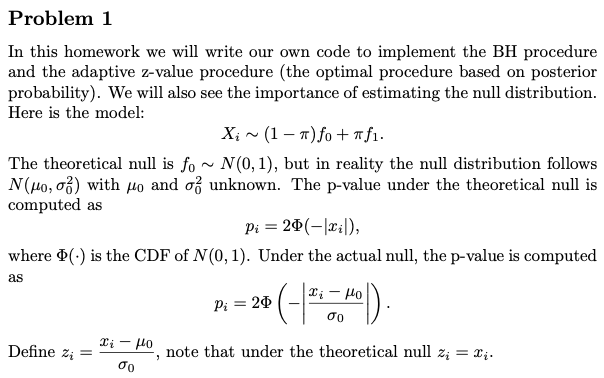
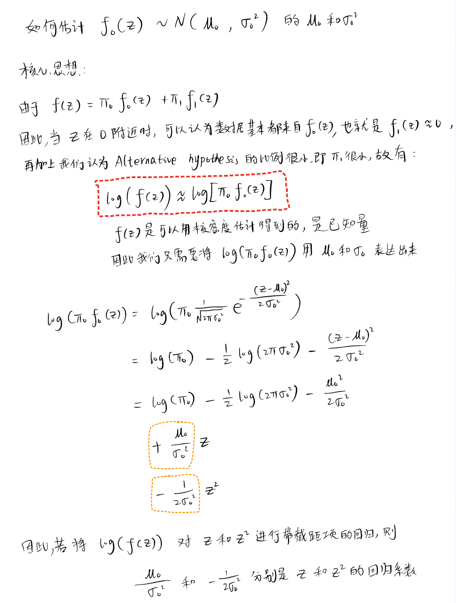
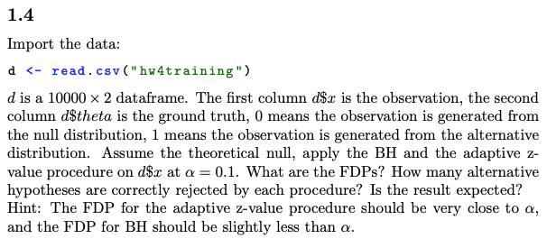
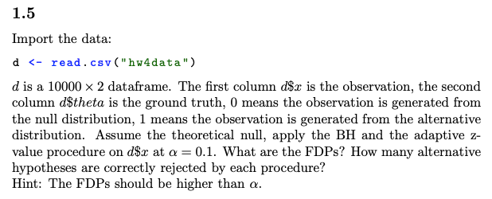
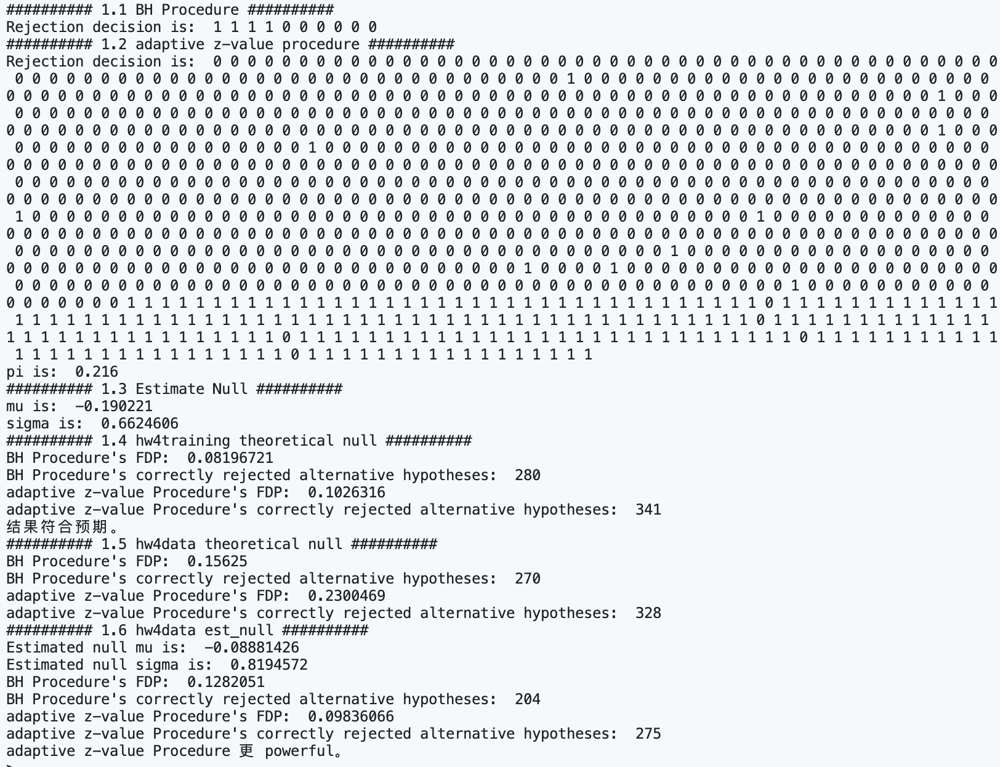

# 多重假设检验

本文使用 Benjamini-Hochberg Procedure 和 Adaptive z-value Procedure 进行多重假设检验，在实际数据上验证了后者的优势，并展示了估计原假设的分布参数的重要性。



## 定义函数，计算 False Discovery Proportion

``` r
# 定义函数，计算 False Discovery Proportion
cal_fdp <- function(de, true_theta) {
    # 计算拒绝的假设总数
    n_rejection <- sum(de)
    # 计算 True Discovery Number
    tdn <- sum(de * true_theta)
    # 计算 False Discovery Proportion
    fdp <- 1 - tdn / n_rejection
    return(fdp)
}
```

## BH Procedure 进行多重假设检验


``` r
########## 1.1 BH Procedure ##########
cat("########## 1.1 BH Procedure ##########", "\n")
# 创建 bh 法的泛型函数
bh <- function() {
    UseMethod("bh")
}

# 定义 bh.func
bh.func <- function(pv, alpha = 0.05) {
    m <- length(pv)
    i <- 1:m
    # 将 p 值从小到大排序
    sorted_pv <- sort(pv)
    # 如果最小的 p 值都大于 alpha / m，则拒绝域为空，直接返回 0 向量
    if (sorted_pv[1] > alpha / m) {
        return(rep(0, m))
    }
    # 找到满足 pvalue <= i/m * alpha 的最大的 i
    k <- max(i[sorted_pv <= i / m * alpha])
    # k 对应的 p 值即为拒绝域的边界
    criterion <- sorted_pv[k]
    # 将 p 值中最小的 k 个值的位置设为 1，其他位置设为 0，并返回
    return(1 * (pv <= criterion))
}
# 测试 BH Procedure
# 生成 10 个 p 值
pv <- c(0.001, 0.005, 0.01, 0.02, 0.03, 0.04, 0.05, 0.06, 0.07, 0.1)
# 打印 Rejection decision
cat("Rejection decision is: ", bh.func(pv, alpha = 0.05), "\n")
```

## Adaptive z-value Procedure 进行多重假设检验


``` r
########## 1.2 adaptive z-value procedure ##########
cat("########## 1.2 adaptive z-value procedure ##########", "\n")
# 创建 adaptive z-value 法的泛型函数
az <- function() {
    UseMethod("az")
}

# 定义 az.func
az.func <- function(zv, alpha = 0.05, tau = 0.5) {
    m <- length(zv)
    # 计算 Oracle Statistic 的分子
    # 先计算 p value
    pv <- 2 * pnorm(-abs(zv))
    # 再计算 alternative hypothesis 的概率
    pi <- 1 - sum(pv >= tau) / (m * (1 - tau))
    # 得到 Oracle Statistic 的分子
    numerator <- (1 - pi) * dnorm(zv)
    # 计算 Oracle Statistic 的分母
    # 使用核密度估计来估计 z 值的密度函数
    den <- density(zv, from = min(zv) - 10, to = max(zv) + 10, n = 2000)
    # 计算每个 z 值的概率密度。由于 z 值不一定出现在 den$x 中，所以需要找到离每个 z 值最近的左右两个点的概率密度，然后线性插值
    denominator <- approx(den$x, den$y, xout = zv)$y
    # 计算 Oracle Statistic
    t_or <- numerator / denominator
    # 将 t_or 从小到大排序
    sorted_t_or <- sort(t_or)
    i <- 1:m
    # 如果最小的 t_or 都大于 alpha，则拒绝域为空，直接返回 0 向量
    if (sorted_t_or[1] > alpha) {
        return(rep(0, m))
    }
    # 找到满足 cumsum(tor_i) / i <= alpha 的最大的 i
    k <- max(i[cumsum(sorted_t_or) / i <= alpha])
    # k 对应的 t_or 即为拒绝域的边界
    criterion <- sorted_t_or[k]
    # 将 t_or 中最小的 k 个值的位置设为 1，其他位置设为 0，并返回
    de <- 1 * (t_or <= criterion)
    return(list("de" = de, "pi" = pi))
}
# 测试 adaptive z-value procedure
# 生成 800 个 null hypothesis 下的 z 值，生成 200 个 alternative hypothesis 下的 z 值
zv <- c(rnorm(800, 0, 1), rnorm(200, 4, 1))
result <- az.func(zv, alpha = 0.05, tau = 0.5)
# 打印 Rejection decision
cat("Rejection decision is: ", result$de, "\n")
# 打印 pi
cat("pi is: ", result$pi, "\n")
```

## 估计原假设的分布参数




``` r
########## 1.3 Estimate Null ##########
cat("########## 1.3 Estimate Null ##########", "\n")
# 创建 Estimate Null 法的泛型函数
est_null <- function() {
    UseMethod("EstNull")
}

# 定义 est_null.func
est_null.func <- function(x) {
    # 计算标准化后的 x，得到 z 值
    zv <- scale(x)[, 1]
    # 使用核密度估计来估计 z 值的密度函数
    den <- density(zv, from = min(zv) - 10, to = max(zv) + 10, n = 2000)
    # 在 0 附近生成多个 z 值，用于拟合回归系数以求出 Null distribution 的参数
    zv <- runif(10000, -0.5, 0.5)
    # 计算各 zv 在 f(x) 下的概率密度
    f_zv <- approx(den$x, den$y, xout = zv)$y
    # 将 f_zv 取对数
    log_f_zv <- log(f_zv)
    # 将 log_f_zv 与 zv 和 zv^2 进行带截距的线性回归
    fit <- lm(log_f_zv ~ zv + I(zv^2))
    # 得到回归系数
    sigma <- sqrt(-1 / (2 * fit$coefficients[3]))
    mu <- fit$coefficients[2] * sigma^2
    # 返回 mu 和 sigma
    return(list("mu" = mu, "sigma" = sigma))
}
# 测试 Estimate Null
x <- c(-1, -0.5, -0.2, 0.01, 0.05, 0.26, 0.5, 0.6, 1.2, 2)
result <- est_null.func(x)
# 打印 mu 和 sigma
cat("mu is: ", result$mu, "\n")
cat("sigma is: ", result$sigma, "\n")
```

## 使用数据进行检验

### 真实数据服从 theoretical null



``` r
########## 1.4 hw4training theoretical null ##########
cat("########## 1.4 hw4training theoretical null ##########", "\n")
d <- read.csv("hw4training")
# 计算每个观测值的 p 值
p <- 2 * pnorm(-abs(d$x))
# 使用 BH Procedure
# 计算假设检验的结果
result_bh <- bh.func(p, alpha = 0.1)
# 打印结果
cat("BH Procedure's FDP: ", cal_fdp(result_bh, d$theta), "\n")
n_correctly_rejected_bh <- sum(result_bh * d$theta)
cat(
    "BH Procedure's correctly rejected alternative hypotheses: ",
    n_correctly_rejected_bh, "\n"
)
# 使用 adaptive z-value procedure
# 计算假设检验的结果
result_az <- az.func(d$x, alpha = 0.1, tau = 0.5)$de
# 打印结果
cat("adaptive z-value Procedure's FDP: ", cal_fdp(result_az, d$theta), "\n")
n_correctly_rejected_az <- sum(result_az * d$theta)
cat(
    "adaptive z-value Procedure's correctly rejected alternative hypotheses: ",
    n_correctly_rejected_az, "\n"
)
cat("结果符合预期。", "\n")
```

### 真实数据不服从 theoretical null



``` r
########## 1.5 hw4data theoretical null ##########
cat("########## 1.5 hw4data theoretical null ##########", "\n")
d <- read.csv("hw4data")
# 计算每个观测值的 p 值
p <- 2 * pnorm(-abs(d$x))
# 使用 BH Procedure
# 计算假设检验的结果
result_bh <- bh.func(p, alpha = 0.1)
# 打印结果
cat("BH Procedure's FDP: ", cal_fdp(result_bh, d$theta), "\n")
n_correctly_rejected_bh <- sum(result_bh * d$theta)
cat(
    "BH Procedure's correctly rejected alternative hypotheses: ",
    n_correctly_rejected_bh, "\n"
)
# 使用 adaptive z-value procedure
# 计算假设检验的结果
result_az <- az.func(d$x, alpha = 0.1, tau = 0.5)$de
# 打印结果
cat("adaptive z-value Procedure's FDP: ", cal_fdp(result_az, d$theta), "\n")
n_correctly_rejected_az <- sum(result_az * d$theta)
cat(
    "adaptive z-value Procedure's correctly rejected alternative hypotheses: ",
    n_correctly_rejected_az, "\n"
)
```

### 真实数据不服从 theoretical null，需要先估计元假设的分布参数


``` r
########## 1.6 hw4data est_null ##########
cat("########## 1.6 hw4data est_null ##########", "\n")
d <- read.csv("hw4data")
# 使用 est_null.func 估计 Null distribution 的参数
params <- est_null.func(d$x)
mu <- params$mu
sigma <- params$sigma
cat("Estimated null mu is: ", mu, "\n")
cat("Estimated null sigma is: ", sigma, "\n")
# 使用 BH Procedure
# 在 mu 和 sigma 的基础上计算每个观测值的 z 值
# 也就是将每个观测值标准化到均值为 mu，标准差为 sigma 的正态分布下
z <- (scale(d$x)[, 1] - mu) / sigma
p <- 2 * pnorm(-abs(z))
# 计算假设检验的结果
result_bh <- bh.func(p, alpha = 0.1)
# 打印结果
cat("BH Procedure's FDP: ", cal_fdp(result_bh, d$theta), "\n")
n_correctly_rejected_bh <- sum(result_bh * d$theta)
cat(
    "BH Procedure's correctly rejected alternative hypotheses: ",
    n_correctly_rejected_bh, "\n"
)
# 使用 adaptive z-value procedure
# 计算假设检验的结果
result_az <- az.func(z, alpha = 0.1, tau = 0.5)$de
# 打印结果
cat("adaptive z-value Procedure's FDP: ", cal_fdp(result_az, d$theta), "\n")
n_correctly_rejected_az <- sum(result_az * d$theta)
cat(
    "adaptive z-value Procedure's correctly rejected alternative hypotheses: ",
    n_correctly_rejected_az, "\n"
)
cat("adaptive z-value Procedure 更 powerful。", "\n")
```

## 程序运行结果


