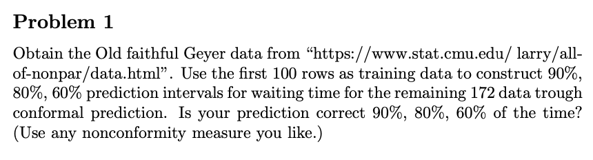
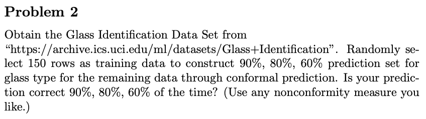

# Conformal Learning 求解回归问题和多标签分类问题

Conformal Learning 是一种非参数统计方法，利用“样本属于某个标签时的离群程度”来进行回归和分类。本文分别使用“老忠实泉的爆发和等待时间数据”进行回归预测，使用“玻璃分类数据”进行多标签分类预测。

参考文献：[A Tutorial on Conformal Prediction](https://jmlr.csail.mit.edu/papers/volume9/shafer08a/shafer08a.pdf)

!!! note "回归问题"

	1. 对于训练集的某一个样本 $i$，找到离样本 $i$ 最近的样本。
	
		- 若最近的样本只有一个，记为样本 $j$，则计算样本 $i$ 和 样本 $j$ 的标签之间的差值的绝对值；
	
		- 若最近的样本有多个，则先计算这多个样本的标签的中位数，再将样本 $i$ 的标签值与该中位数做差后取绝对值。
	
	2. 此“绝对值”就衡量了样本 $i$ 的离群程度。
	
	3. 对于一个新样本 $n$，同样找到离样本 $n$ 最近的样本，用“离样本 $n$ 最近的一个或多个样本的标签的中位数”作为新样本的标签预测值。
	
	4. 根据信心水平 $level$（例如 $90\%$），选定一个离群程度，使得该离群程度在所有训练样本的离群程度中的大小排名分位数是 $1-level$（例如 $10\%$，即100个数中第10大的数）。
	
	5. 在该预测值的基础上加减上一步选定的离群程度，就得到新样本标签值的预测区间。

!!! note "分类问题"

	1. 对于一个新样本，为其赋予所有可能的标签后，将其纳入训练样本中，形成一个 Bag。
	2. 对于 Bag 中的每一个样本：
		1. 对于与该样本的标签相同的其他样本，计算它们与该样本的距离，从中选择最小的，作为分子。
		2. 对于与该样本的标签不同的其他样本，计算它们与该样本的距离，从中选择最小的，作为分母。
		3. 将前两步的分子除以分母，即可衡量“为该样本赋予该标签时的离群程度”。该值越大，说明分子越大、分母越小。
			- 分子越大，说明虽然标签相同但距离很远，可以推测这个样本很可能并不属于这个标签。
			- 分母越大，说明虽然标签不同但距离很近，可以推测这个样本很可能属于其他标签。
	3. 对于每一个可能的标签，根据信心水平 $level$（例如 $90\%$），判断：当新样本确实属于这个标签时，Bag 中有多少比例样本的离群程度比新样本的离群程度更高。如果这个比例超过了 $1-level$（例如 $10\%$），则将这个标签加入到预测标签集中。
	4. 输出预测标签集，它可能有一个或多个预测值，也可能是空集。


<!-- more -->

## Problem 1：使用 Conformal Learning 求解回归问题



### 导入包


```python
import pandas as pd
import numpy as np
from scipy.spatial.distance import cdist
```

### 导入数据


```python
# 读取 faithful.dat 数据集，两列数据分别为喷发时间和等待时间
df = pd.read_csv('./P1/faithful.dat', delimiter='\s+').reset_index(drop=True)
# 选取数据集的前 100 行作为训练集
train_df = df.iloc[:100, :]
```

### 基于 nearest neighbor 计算 nonconformity score


```python
def get_nonconformity_scores(train_df):
    x = train_df["eruptions"].values.reshape(-1, 1)
    y = train_df["waiting"].values.reshape(-1, 1)
    # 计算 x 之间的距离矩阵
    distance = cdist(x, x, "euclidean")
    # 将对角线元素设为无穷大
    np.fill_diagonal(distance, np.inf)
    # 找到每一行的最小值
    min_distance = np.min(distance, axis=1)
    # 找到每一行的最小值的索引
    min_index_row, min_index_column = np.where(distance == min_distance[:, None])
    min_dict = {
        key: [val for i, val in enumerate(min_index_column) if min_index_row[i] == key]
        for key in set(min_index_row)
    }
    # 计算离每个样本最近的样本的 y 的中位数，做差后计算绝对值，作为 nonconformity score
    nonconformity_scores = []
    for i in range(train_df.shape[0]):
        nonconformity_scores.append(abs(y[i] - np.median(y[min_dict[i]]))[0])
    return nonconformity_scores
```

### 计算每个新样本的 prediction interval


```python
def get_prediction_interval(train_df, new_x, level):
    # 计算训练样本的 nonconformity score
    nonconformity_scores = get_nonconformity_scores(train_df)
    # 计算新样本的与训练样本的距离的最小值
    min_distance = np.min(
        abs(train_df["eruptions"].values.reshape(-1, 1) - new_x), axis=0
    )
    # 找到最小值的索引
    min_index = np.where(
        abs(train_df["eruptions"].values.reshape(-1, 1) - new_x) == min_distance
    )[0]
    # 计算新样本的预测值
    prediction = np.median(train_df["waiting"].values[min_index])
    # 计算 nonconformity scores 的 level 分位数，即保证有 1 - level 的样本的 nonconformity score 大于等于该值
    nonconformity_score_at_level = nonconformity_scores[
        np.argsort(nonconformity_scores)[::-1][
            int((1 - level) * len(nonconformity_scores))
        ]
    ]
    # 计算新样本的 predition interval
    lower_bound = prediction - nonconformity_score_at_level
    upper_bound = prediction + nonconformity_score_at_level
    return lower_bound, upper_bound
```

### 计算不同置信度下的预测准确率


```python
level_list = [0.9, 0.8, 0.6]
for level in level_list:
    count = 0
    for i in range(100, df.shape[0]):
        lower_bound, upper_bound = get_prediction_interval(train_df, df["eruptions"].iloc[i], level)
        if df["waiting"].iloc[i] > lower_bound and df["waiting"].iloc[i] < upper_bound:
            count += 1
    correct_rate = count / (i - 100 + 1)
    print("level: {:.2%}, correct rate: {:.2%}".format(level, correct_rate))
```

    level: 90.00%, correct rate: 86.05%
    level: 80.00%, correct rate: 79.07%
    level: 60.00%, correct rate: 51.16%


在不同置信度下，预测准确率大致略低于置信度。

## Problem 2：使用 Conformal Learning 求解多标签分类问题



### 导入包


```python
from sklearn.preprocessing import StandardScaler
```

### 导入数据


```python
# 读取 glass.data 数据集
df = pd.read_csv('./P2/glass.data', delimiter=',', header=None, index_col=0)
# 创建标准化器对象
scaler = StandardScaler()
# 随机选择 150 个样本作为训练集
train_df = df.sample(n=150, random_state=0)
# 对自变量进行标准化
train_df.iloc[:, :-1] = scaler.fit_transform(train_df.iloc[:, :-1])
# 剩下的样本作为测试集
test_df = df.drop(train_df.index)
# 对自变量进行标准化
test_df.iloc[:, :-1] = scaler.transform(test_df.iloc[:, :-1])
# 重新索引
train_df = train_df.reset_index(drop=True)
test_df = test_df.reset_index(drop=True)
```

### 基于 nearest neighbor 计算 nonconformity score


```python
def get_nonconformity_scores(train_df, new_x, new_y):
    x = pd.concat([train_df.iloc[:, :-1], new_x.to_frame().T], axis=0).reset_index(
        drop=True
    )
    y = pd.concat([train_df.iloc[:, -1], pd.Series([new_y])]).reset_index(drop=True)
    # 计算 x 之间的距离矩阵
    distance = cdist(x, x, "euclidean")
    # 将对角线元素设为无穷大
    np.fill_diagonal(distance, np.inf)
    # 计算相同标签的最小距离和不同标签的最小距离的比值，作为 nonconformity score
    nonconformity_scores = []
    for i in range(x.shape[0]):
        # 找到第 i 行中，与样本 i 标签相同的所有样本，并求其距离的最小值
        min_distance_with_same_label = np.min(distance[i, y == y[i]])
        # 找到第 i 行中，与样本 i 标签不同的所有样本，并求其距离的最小值
        min_distance_with_different_label = np.min(distance[i, y != y[i]])
        # 计算第 i 行的 nonconformity score
        nonconformity_score = (
            min_distance_with_same_label / min_distance_with_different_label
        )
        nonconformity_scores.append(nonconformity_score)
    return nonconformity_scores
```

### 计算每个新样本的 prediction set


```python
def get_prediction_set(train_df, new_x, level):
    # 遍历所有可能的标签值，计算新样本在该标签下的 p value
    p_values = []
    labels = list(set(train_df.iloc[:, -1]))
    for label in labels:
        # 计算训练样本的 nonconformity scores
        nonconformity_scores = get_nonconformity_scores(train_df, new_x, label)
        # 计算新样本的 nonconformity score 在训练样本中的排名
        rank = sum(nonconformity_scores >= nonconformity_scores[-1])
        # 计算 p value
        p_value = rank / len(nonconformity_scores)
        p_values.append(p_value)
    # 找到 p value 大于 1 - level 的标签
    prediction_set = [labels[i] if p_values[i] > 1 - level else None for i in range(len(p_values))]
    # 去掉 None
    prediction_set = [i for i in prediction_set if i is not None]
    return prediction_set
```

### 计算不同置信度下的预测准确率


```python
level_list = [0.9, 0.8, 0.6]
for level in level_list:
    count = 0
    for i in range(test_df.shape[0]):
        prediction_set = get_prediction_set(train_df, test_df.iloc[i, :-1], level)
        if test_df.iloc[i, -1] in prediction_set:
            count += 1
    correct_rate = count / test_df.shape[0]
    print("level: {:.2%}, correct rate: {:.2%}".format(level, correct_rate))
```

    level: 90.00%, correct rate: 90.62%
    level: 80.00%, correct rate: 76.56%
    level: 60.00%, correct rate: 57.81%


在不同置信度下，预测准确率与置信度十分相近。
